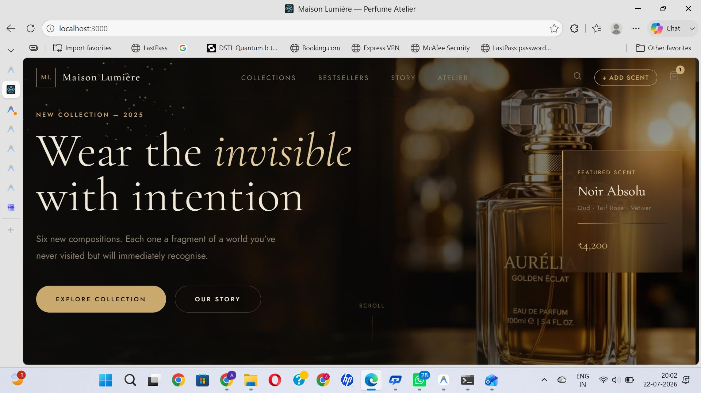
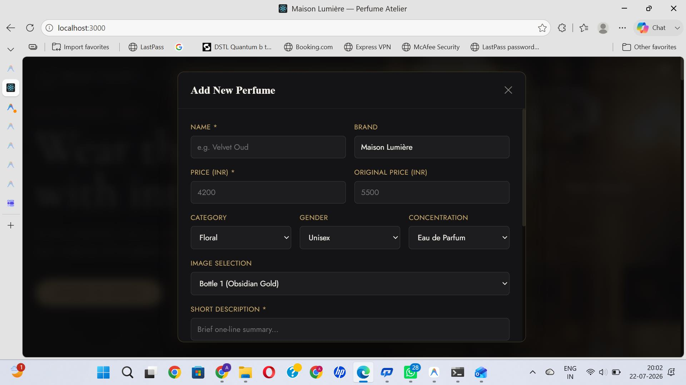
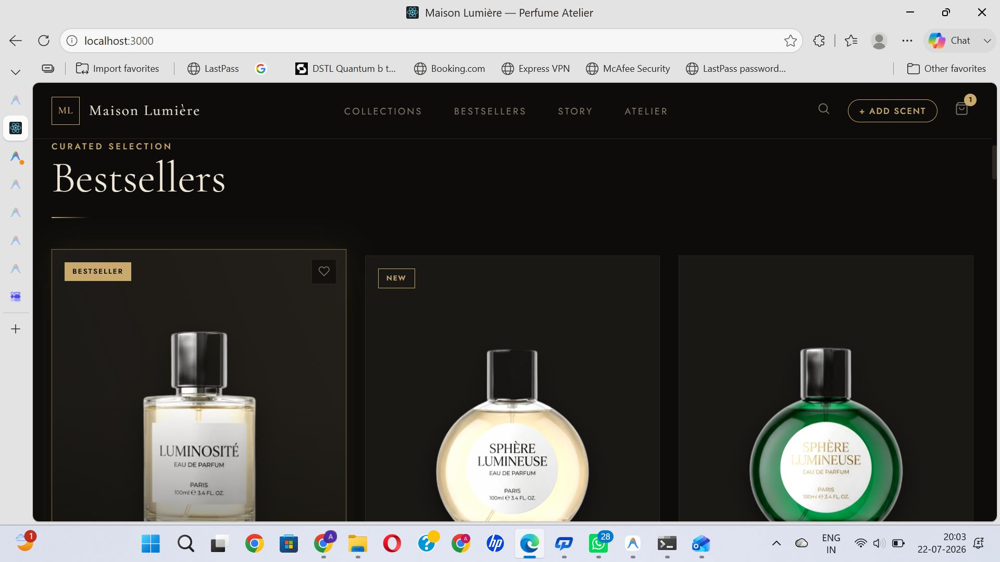
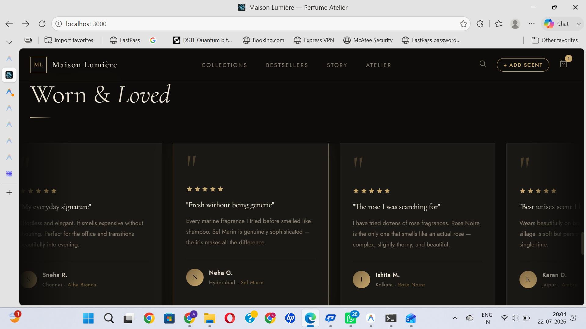
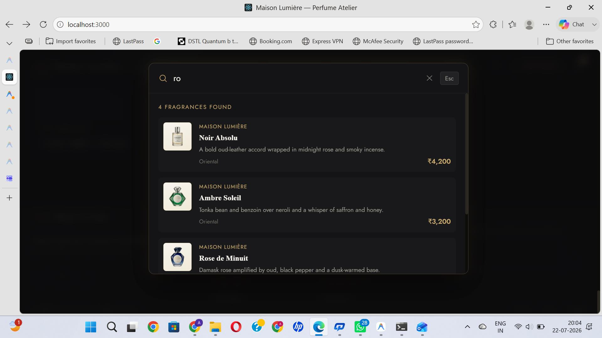
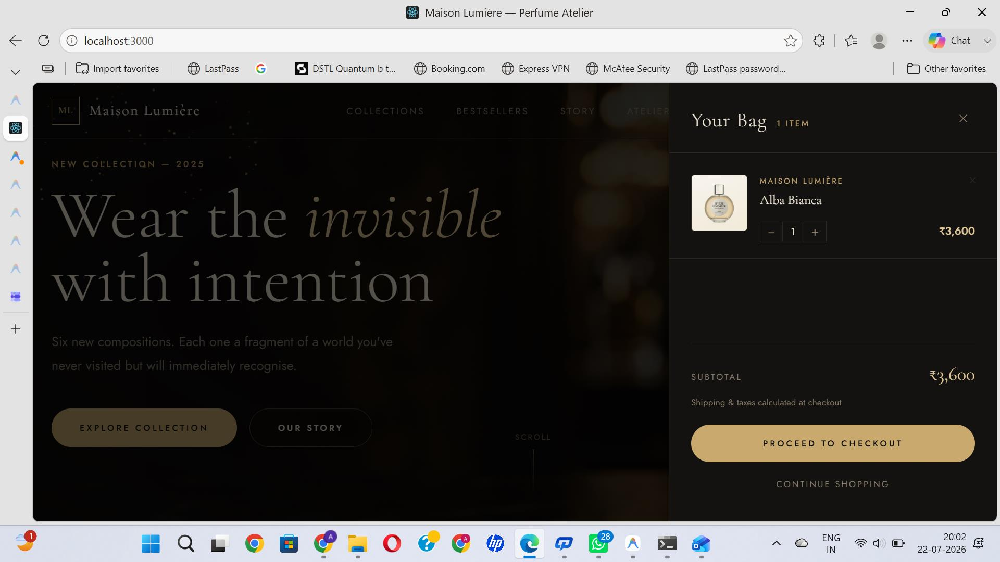

<div align="center">

# 🌟 Maison Lumière

### Premium Luxury Perfume Shop

Elegant Full Stack MERN E-Commerce Website inspired by premium perfume brands.

<p align="center">


</p>

---

### 🚀 Live Demo

**Frontend**

https://perfume-shop-frontend.onrender.com

**Backend API**

https://perfume-shop-bmyt.onrender.com/api/products

**Health Check**

https://perfume-shop-bmyt.onrender.com/api/health

</div>

---

# 📖 Overview

Maison Lumière is a modern luxury perfume shopping platform built using the MERN stack. It provides an elegant user experience with dynamic product browsing, detailed perfume descriptions, customer reviews, product search, and a complete REST API powered by Express and MongoDB Atlas.

The application follows a clean client-server architecture where React handles the frontend while Express and MongoDB manage backend services and persistent storage.

---

# ✨ Highlights

- 🌸 Luxury UI Design
- 🛍 Premium Product Collection
- 🔍 Search Functionality
- ⭐ Customer Reviews
- 📦 Dynamic Product Details
- ➕ Add New Products
- ☁ MongoDB Atlas Integration
- ⚡ REST API
- 📱 Responsive Design
- 🚀 Render Deployment

---

# 🛠 Tech Stack

| Frontend | Backend | Database | Deployment |
|-----------|----------|-----------|------------|
| React | Node.js | MongoDB Atlas | Render |
| React Router | Express.js | Mongoose | GitHub |
| Axios | REST API | | |

---

# 🏗 Architecture

```
React Frontend
      │
      ▼
Axios API Calls
      │
      ▼
Express REST API
      │
      ▼
MongoDB Atlas
```

---

# 📸 Application Screenshots

<div align="center">

### 🏠 Home



---

### ⭐ Featured Collection



---

### 🛍 Product Collection



---

### ⭐ Customer Reviews



---

### 🔍 Search



---

### ➕ Add Product



</div>

---

# 📂 Folder Structure

```
Perfume-Shop
│
├── client
│   ├── public
│   ├── src
│   └── package.json
│
├── server
│   ├── models
│   ├── routes
│   ├── data
│   ├── index.js
│   └── package.json
│
├── Screenshots
│
├── README.md
│
└── .gitignore
```

---

# ⚙ Installation

## Clone Repository

```bash
git clone https://github.com/atulsharma47/Perfume-Shop.git
```

```bash
cd Perfume-Shop
```

---

## Install Frontend

```bash
cd client
npm install
npm start
```

Runs on

```
http://localhost:3000
```

---

## Install Backend

```bash
cd server
npm install
```

Create a `.env`

```
PORT=5000
MONGO_URI=your_mongodb_connection_string
```

Run

```bash
npm start
```

Backend

```
http://localhost:5000
```

---

# 📡 API Endpoints

| Method | Endpoint | Description |
|----------|-------------------------------|----------------|
| GET | `/api/products` | Fetch all products |
| GET | `/api/products/:id` | Fetch product by ID |
| POST | `/api/products` | Add new product |
| POST | `/api/products/:id/reviews` | Add review |
| GET | `/api/health` | Server health |

---

# 🚀 Future Improvements

- ❤️ Wishlist
- 🛒 Shopping Cart
- 💳 Stripe Payments
- 👤 User Authentication
- 📦 Order Management
- 🔐 Admin Dashboard
- 📱 Progressive Web App
- 🌙 Dark Theme
- 🔔 Notifications

---

# 👨‍💻 Developer

<div align="center">

## Atul Sharma

Full Stack Developer

GitHub

https://github.com/atulsharma47

</div>

---

<div align="center">

### ⭐ If you found this project useful, consider giving it a Star ⭐

Made with ❤️ using React, Express.js and MongoDB Atlas

</div>
